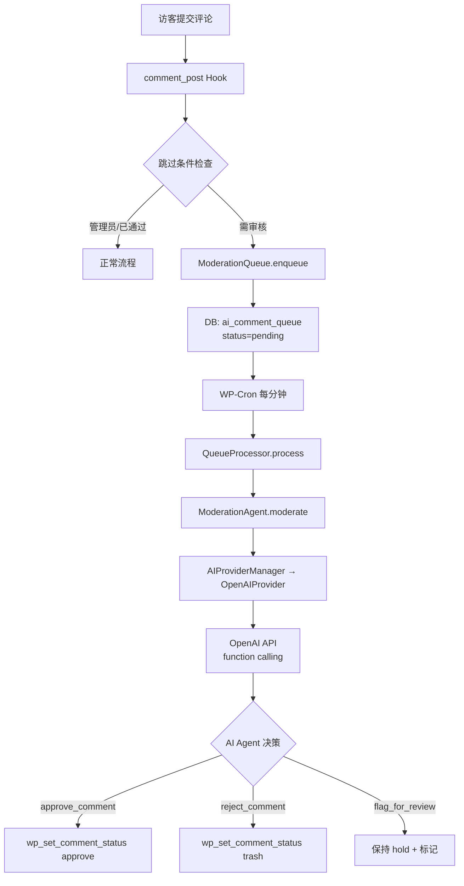

# AI Comment Moderator — 项目创建完成

## 创建的文件

### 插件骨架
| 文件 | 说明 |
|---|---|
| [ai-comment-moderator.php](file:///c:/Users/Xenon/Desktop/ai-comment-moderator/ai-comment-moderator.php) | 主入口，常量定义 + classmap 自动加载 + 激活/停用钩子 |
| [package.json](file:///c:/Users/Xenon/Desktop/ai-comment-moderator/package.json) | 前端依赖（React 18 + WP 组件库） |
| [webpack.config.js](file:///c:/Users/Xenon/Desktop/ai-comment-moderator/webpack.config.js) | wp-scripts 构建配置 |
| [readme.txt](file:///c:/Users/Xenon/Desktop/ai-comment-moderator/readme.txt) | WordPress.org 标准说明 |

### PHP 后端（10 个文件）
| 文件 | 类名 | 职责 |
|---|---|---|
| [class-ai-provider-interface.php](file:///c:/Users/Xenon/Desktop/ai-comment-moderator/includes/class-ai-provider-interface.php) | [AIProviderInterface](file:///c:/Users/Xenon/Desktop/ai-comment-moderator/includes/class-ai-provider-interface.php#13-60) | AI 提供者接口 |
| [class-openai-provider.php](file:///c:/Users/Xenon/Desktop/ai-comment-moderator/includes/class-openai-provider.php) | [OpenAIProvider](file:///c:/Users/Xenon/Desktop/ai-comment-moderator/includes/class-openai-provider.php#13-173) | OpenAI 实现（function calling） |
| [class-ai-provider-manager.php](file:///c:/Users/Xenon/Desktop/ai-comment-moderator/includes/class-ai-provider-manager.php) | [AIProviderManager](file:///c:/Users/Xenon/Desktop/ai-comment-moderator/includes/class-ai-provider-manager.php#13-95) | Provider 注册/管理 |
| [class-moderation-agent.php](file:///c:/Users/Xenon/Desktop/ai-comment-moderator/includes/class-moderation-agent.php) | [ModerationAgent](file:///c:/Users/Xenon/Desktop/ai-comment-moderator/includes/class-moderation-agent.php#13-251) | **核心 Agent**（3 个 tools + system prompt） |
| [class-moderation-queue.php](file:///c:/Users/Xenon/Desktop/ai-comment-moderator/includes/class-moderation-queue.php) | [ModerationQueue](file:///c:/Users/Xenon/Desktop/ai-comment-moderator/includes/class-moderation-queue.php#13-276) | 审核队列 DB 表管理 |
| [class-queue-processor.php](file:///c:/Users/Xenon/Desktop/ai-comment-moderator/includes/class-queue-processor.php) | [QueueProcessor](file:///c:/Users/Xenon/Desktop/ai-comment-moderator/includes/class-queue-processor.php#13-230) | WP-Cron 队列处理器 |
| [class-comment-hooks.php](file:///c:/Users/Xenon/Desktop/ai-comment-moderator/includes/class-comment-hooks.php) | [CommentHooks](file:///c:/Users/Xenon/Desktop/ai-comment-moderator/includes/class-comment-hooks.php#13-204) | WordPress 评论钩子集成 |
| [class-admin.php](file:///c:/Users/Xenon/Desktop/ai-comment-moderator/includes/class-admin.php) | [Admin](file:///c:/Users/Xenon/Desktop/ai-comment-moderator/includes/class-admin.php#13-193) | 后台菜单 + React 挂载 + 通知 |
| [class-rest-api.php](file:///c:/Users/Xenon/Desktop/ai-comment-moderator/includes/class-rest-api.php) | [RestAPI](file:///c:/Users/Xenon/Desktop/ai-comment-moderator/includes/class-rest-api.php#12-346) | 8 个 REST 端点 |
| [class-audit-log.php](file:///c:/Users/Xenon/Desktop/ai-comment-moderator/includes/class-audit-log.php) | [AuditLog](file:///c:/Users/Xenon/Desktop/ai-comment-moderator/includes/class-audit-log.php#13-162) | 审核日志记录 |

### React 前端（7 个文件）
| 文件 | 说明 |
|---|---|
| [settings.js](file:///c:/Users/Xenon/Desktop/ai-comment-moderator/src/settings.js) | SPA 入口 |
| [App.jsx](file:///c:/Users/Xenon/Desktop/ai-comment-moderator/src/components/App.jsx) | 主组件（Tab 导航 + 通知） |
| [SettingsTab.jsx](file:///c:/Users/Xenon/Desktop/ai-comment-moderator/src/components/SettingsTab.jsx) | 设置页（AI 配置 + 审核规则 + Prompt 编辑） |
| [QueueTab.jsx](file:///c:/Users/Xenon/Desktop/ai-comment-moderator/src/components/QueueTab.jsx) | 队列管理（表格 + 筛选 + 重试/删除） |
| [LogsTab.jsx](file:///c:/Users/Xenon/Desktop/ai-comment-moderator/src/components/LogsTab.jsx) | 审核日志查看器 |
| [StatsTab.jsx](file:///c:/Users/Xenon/Desktop/ai-comment-moderator/src/components/StatsTab.jsx) | 统计看板（6 个指标卡片） |
| [admin.css](file:///c:/Users/Xenon/Desktop/ai-comment-moderator/src/styles/admin.css) | 管理页样式 |

---

## 架构图



## 下一步操作

```bash
# 1. 安装依赖
cd c:\Users\Xenon\Desktop\ai-comment-moderator
npm install

# 2. 构建 React SPA
npm run build

# 3. 部署到 WordPress
# 将 ai-comment-moderator 目录复制到 wp-content/plugins/

# 4. 在 WordPress 后台激活插件

# 5. 前往「评论 → AI 审核」配置 API Key
```
